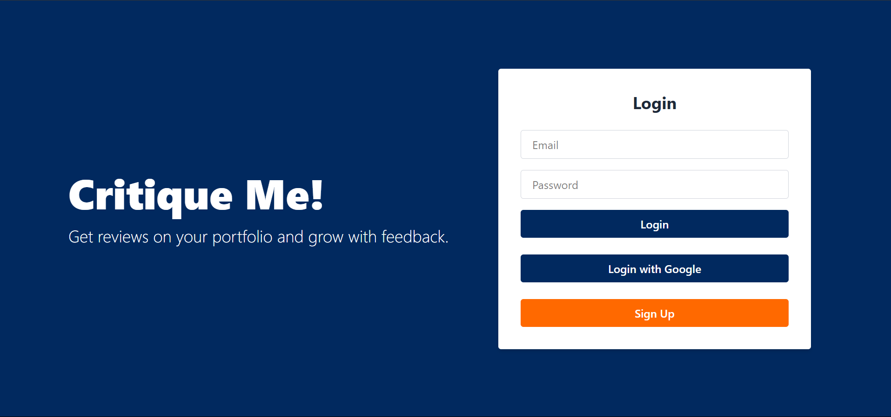
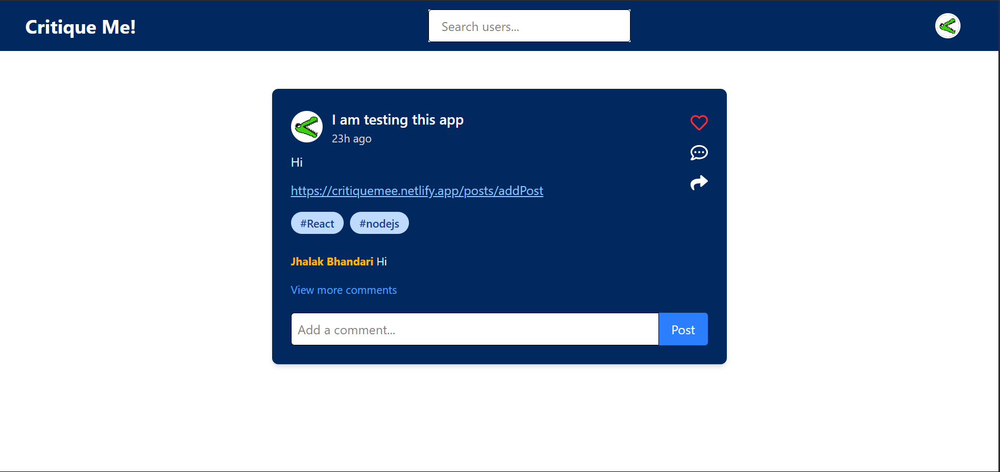
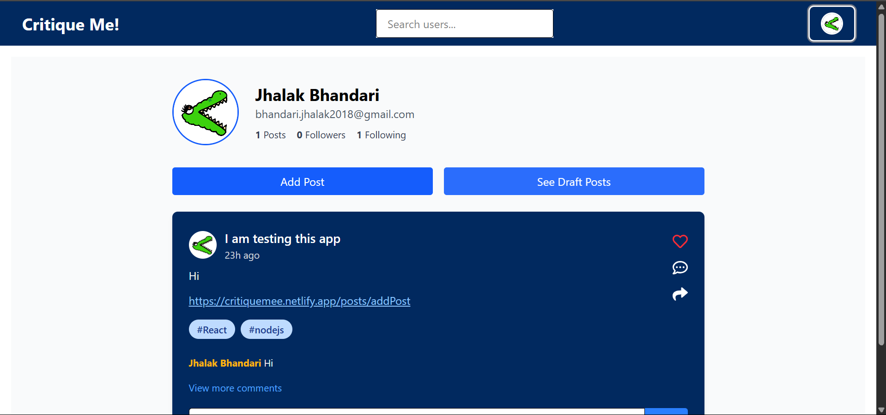
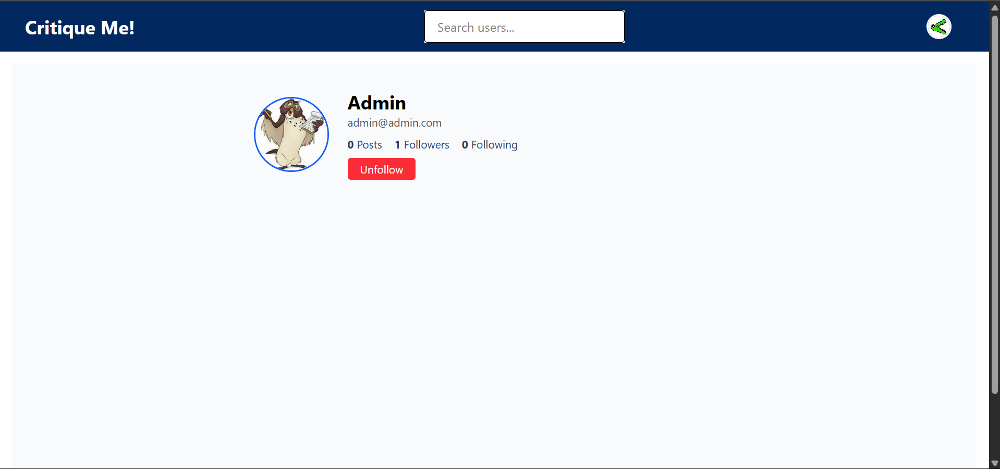

# Critique Me!

A fullstack MERN social platform for creative feedback on portfolio.

## Demo

https://critiquemee.netlify.app/login

## Features

- 🔐 JWT-based Authentication with Google OAuth
- 📷 Upload and comment on posts
- 🧵 Follow/unfollow users with instant feed updates
- 🛠️ Role-based access control for admin features
- 📸 Profile picture upload

## Tech Stack

**Client:** React + Typescript, Redux, TailwindCSS, React Router

**Server:** Node, Express, helmet, Prisma ORM

**Database:** MongoDB Atlas   

## Deployment

**Client:** Netlify

**Server:** Railway

## Screenshots

##  🤝 Contributors

Thanks to everyone who helped build this project:

- [@jhalakbhandari](https://github.com/jhalakbhandari) – Frontend & Backend
- [@GarimaBisht22](https://github.com/GarimaBisht22) – Backend  
- [@RohanBist33](https://github.com/RohanBist33) – Frontend
## 📌 Project Roadmap

We’re actively building and improving features.  
Check out our progress here:  
👉 [View Our Project Board](https://github.com/users/jhalakbhandari/projects/1/views/1)